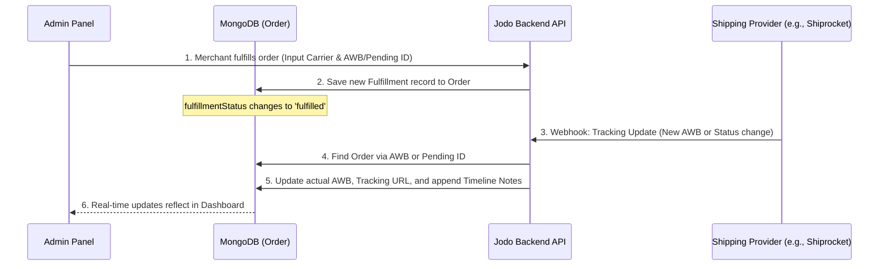

# Complete Shipping & 3PL Integration Guide


---

## 1. System Architecture & Data Flow

When an order is placed, merchants use the Jodo Admin Panel to fulfill the order. The system allows for temporary Air Waybills (AWBs) during initial fulfillment and relies on 3PL webhooks to supply the real AWB and continuous tracking updates.



---

## 2. Database Schema (Mongoose)

Shipping and fulfillment data is managed within the `Order` model (`apps/api/src/models/Order.ts`).

### The Fulfillment Sub-Document
Each order contains a `fulfillments` array. A single order can have multiple fulfillments (partial fulfillment).

```typescript
export interface IFulfillment {
  carrier: string;          // e.g., "Shiprocket", "Delhivery", "BlueDart"
  trackingNumber: string;   // Air Waybill (AWB) or Temporary ID (e.g., "SR-PENDING-123")
  trackingUrl?: string;     // Clickable tracking URL for the customer and merchant
  notifyCustomer: boolean;  // Boolean trigger for transactional emails/SMS
  createdAt: Date;          // Timestamp of fulfillment creation
}
```

### The Shipping Address Object
Provided securely inside the Order document for label generation:

```typescript
export interface IShippingAddress {
  firstName: string;
  lastName: string;
  address1: string;
  address2?: string;
  city: string;
  state: string;
  zip: string;
  country: string;
  phone?: string;          // Customer contact for delivery agents
}
```

### Core Order Status Fields
- `fulfillmentStatus`: Enum `['unfulfilled', 'partial', 'fulfilled', 'returned']`.
- `status`: Enum `['open', 'archived', 'cancelled', 'draft']`.
- `notes`: A string field where webhook lifecycle events (In Transit, Delivered) are appended automatically.

---

## 3. Admin Panel Workflow

The Admin UI (`apps/admin/src/app/(dashboard)/orders/[id]/page.tsx`) provides merchants with full visibility over shipping.

1. **Initiation**: If an order is `unfulfilled`, merchants click the **Fulfill Order** button.
2. **Fulfillment Dialog**: The merchant inputs the `carrier` and `trackingNumber`. 
   *Note on APIs without immediate AWBs*: If the shipping provider generates the AWB asynchronously, a temporary placeholder identifier (e.g., `SR-PENDING-{internal_id}`) is provided by the backend to the UI.
3. **Display**: The UI instantly populates a "Fulfillment Card" displaying the Carrier and Tracking URL.
4. **Order Timeline (Notes)**: As the package traverses the shipping network, incoming 3PL webhooks append timestamps and status logs into the **Order Notes**.

---

## 4. Webhook Implementation Guide (For 3PL Developers)

The platform receives real-time package updates via RESTful webhooks. (Reference: `apps/api/src/routes/webhooks.ts`)

### 4.1 Endpoint Details
- **Method**: `POST`
- **URL Path**: `/api/webhooks/{provider_name}` (e.g., `/api/webhooks/shiprocket`)
- **Content-Type**: `application/json`

### 4.2 Expected Request Payload
The integration expects a JSON body containing the following core properties. (Additional fields may be sent, but these are required to parse the update).

```json
{
  "order_id": "12345678",        // The internal 3PL Order ID (Used for fallback matching)
  "awb": "10987654321",          // The actual Air Waybill / Tracking ID
  "current_status_id": 7,        // Numeric status code
  "current_status": "Delivered"  // String status definition
}
```

### 4.3 Webhook Processing Logic & Fallbacks

When a webhook arrives, the Jodo Backend executes a resilient two-step lookup to locate the order:

**Step 1: Direct AWB Match**
The database is queried to find any Order containing a Fulfillment where `trackingNumber` precisely matches the incoming `awb` (Case-Insensitive).

**Step 2: Fallback Pending ID Match (Important for Asynchronous AWBs)**
If Step 1 fails, it assumes the AWB was not generated at the exact time of order fulfillment. The backend searches for a placeholder string using the `order_id` provided in the payload (e.g., `SR-PENDING-{order_id}`). 
- **If Found**: The backend permanently replaces the pending placeholder with the incoming `awb` and dynamically generates the `trackingUrl`. 
- **If Not Found**: A `404 Not Found` response is returned.

### 4.4 Status Mapping & Logging

The platform leverages the `current_status_id` to translate shipping lifecycle events into Merchant-facing logs in the `notes` column.

| Status ID | Provider Event Name | Action Taken by Jodo Backend |
| :--- | :--- | :--- |
| **7** | Delivered | Appends note: `[Webhook] Order delivered on {timestamp}` |
| **18**| In Transit| Appends note: `[Webhook] Order in transit on {timestamp}` |
| *(Custom)* | RTO / Cancelled | *Can be added by mapping new IDs to internal logic* |

### 4.5 Standard Server Responses
- `200 OK`: `{"message": "Webhook processed successfully"}` (Status log updated)
- `200 OK`: `{"message": "Webhook processed and AWB updated"}` (Pending AWB converted to Real AWB)
- `400 Bad Request`: `{"error": "AWB is required"}` (Malformed Payload)
- `404 Not Found`: `{"error": "Order with this AWB/OrderID not found"}` (Unrecognized tracking ID)

---

## 5. Sample Integration Code

For developers integrating a new 3PL, here is the reference TypeScript logic implemented on the Jodo Backend:

```typescript
router.post('/shiprocket', async (req, res, next) => {
  const { current_status, current_status_id, awb, order_id } = req.body;
  
  if (!awb) {
    return res.status(400).json({ error: 'AWB is required' });
  }

  // 1. Direct AWB Lookup
  const order = await Order.findOne({
    'fulfillments.trackingNumber': { $regex: new RegExp(awb, 'i') }
  });

  if (!order) {
    // 2. Pending AWB Fallback
    const pendingOrder = await Order.findOne({
      'fulfillments.trackingNumber': `SR-PENDING-${order_id}`
    });
    
    if (!pendingOrder) {
      return res.status(404).json({ error: 'Order with this AWB/OrderID not found' });
    }

    // 2a. Update Placeholder with actual AWB and Tracking URL
    const fulfillment = pendingOrder.fulfillments?.find((f: any) => 
      f.trackingNumber.includes(`SR-PENDING-${order_id}`)
    );
    if (fulfillment) {
      fulfillment.trackingNumber = awb;
      // Configure Base URL for specific carrier here:
      fulfillment.trackingUrl = `https://shiprocket.co/tracking/${awb}`; 
    }
    
    await pendingOrder.save();
    return res.status(200).json({ message: 'Webhook processed and AWB updated' });
  }

  // 3. Lifecycle Status Updates
  const timestamp = new Date().toLocaleString();
  if (current_status_id === 7) { 
    order.notes = (order.notes ? order.notes + '\n' : '') + `[Shiprocket Webhook] Order delivered on ${timestamp}`;
  } else if (current_status_id === 18) { 
    order.notes = (order.notes ? order.notes + '\n' : '') + `[Shiprocket Webhook] Order in transit on ${timestamp}`;
  }

  // 4. Save and return 200 OK
  await order.save();
  res.status(200).json({ message: 'Webhook processed successfully' });
});
```
